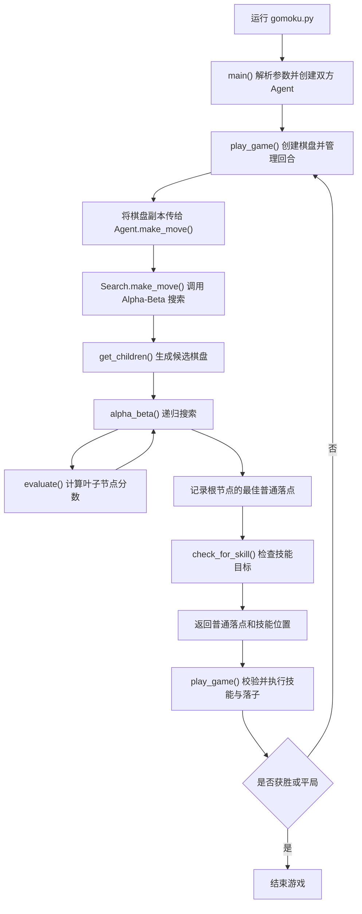

# 五子棋 Minimax AI

这是一个带有一次性封锁技能的五子棋课程项目。项目包含完整的对局流程、命令行棋盘、人类玩家图形界面、随机 Agent，以及一个由 Minimax、Alpha-Beta 剪枝和棋型估值驱动的搜索 Agent。

AI 的主要目标是在有限时间内搜索候选落点，根据双方的连珠形态评估棋盘，并返回普通落子位置和可选的技能位置。

## 课程项目网站

[Project 2: 技能五子棋AI](https://www.lamda.nju.edu.cn/guolz/IntroAI/sp2026/project2.html)

## 功能概览

- 支持自定义棋盘大小；
- 支持 AI 对随机 Agent、AI 对人类玩家，以及加载其他 Agent 模块；
- 检查落子合法性、五子连珠、棋盘占满和每回合超时；
- 每名玩家可以释放一次技能，临时封锁对手下一回合的一个位置；
- 搜索 Agent 使用深度为 3 的 Minimax 搜索和 Alpha-Beta 剪枝；
- 通过棋型奖励函数评价活四、冲四、活三等局面；
- 只搜索已有棋子周围一格的空位，减少搜索分支。

## 运行方法

项目需要 Python 3 和 NumPy。图形界面使用 Python 自带的 Tkinter。

安装 NumPy：

```bash
pip install numpy
```

进入项目目录后运行：

```bash
python gomoku.py --method human --size 15
```

常用参数：

- `--method human`：与图形界面中的人类玩家对战；
- `--method random`：与基础随机 Agent 对战，也是默认模式；
- `--method <模块名>`：加载同目录下具有 `Search` 类的其他 Agent；
- `--size <边长>`：设置棋盘大小，默认值为 11。

例如，在 15 × 15 棋盘上与随机 Agent 对战：

```bash
python gomoku.py --method random --size 15
```

<details>
<summary><strong>常用开发调整位置</strong></summary>

以下配置都集中在 `student.py` 和 `gomoku.py` 中：

- **搜索深度**：修改 `student.py` 中 `Search.__init__()` 的 `self.depth`。深度越大，搜索通常越充分，但运行时间会快速增加。
- **防守系数**：修改 `student.py` 中的 `self.k`。该值越大，普通估值越重视压低对手棋型分数。
- **棋型奖励**：修改 `student.py` 中以 `self.score_` 开头的分数。调整时应保持五子、活四、冲四、活三等威胁的大致等级关系。
- **候选落点范围**：修改 `student.py` 的 `get_children()`。当前只搜索已有棋子周围一格。
- **默认棋盘大小**：修改 `gomoku.py` 中 `--size` 参数的 `default`，也可以在启动命令中直接传入 `--size`。
- **单回合时间限制**：修改 `gomoku.py` 顶部的 `PLAYER_TIME_LIMIT`。
- **先后手与对局双方**：`play_game()` 始终从玩家 1 开始。需要更换先后手时，应在 `gomoku.py` 的 `main()` 中重新安排 `agent1` 和 `agent2`，并确保其构造参数分别为玩家编号 `1` 和 `2`。不要只交换两个已经创建好的对象，否则 Agent 内部保存的玩家编号会与棋盘规则不一致。

</details>

## 项目结构

项目保留四个 Python 源文件：

| 文件 | 主要内容 |
| --- | --- |
| `agent.py` | 定义 Agent 基类和统一的 `make_move(board)` 接口；默认实现会随机选择空位。 |
| `gomoku.py` | 游戏主程序，负责棋盘创建、规则检查、技能应用、回合切换、超时控制和命令行入口。 |
| `human.py` | 基于 Tkinter 的人类玩家界面，负责绘制棋盘、接收点击和选择技能位置。 |
| `student.py` | 搜索 Agent 的主要实现，包含候选落点生成、棋型识别、估值函数、Minimax、Alpha-Beta 剪枝和技能目标检测。 |

所有 Agent 都遵循相同的返回格式：

```python
((row, col), skill_target)
```

其中 `skill_target` 为 `(row, col)` 或 `None`。

## 程序调用流程



## 核心算法：Minimax

五子棋可以看作一个双方轮流行动的零和博弈。搜索 Agent 将自己视为最大化玩家，将对手视为最小化玩家：

- 最大化层选择对 AI 最有利的子节点；
- 最小化层假设对手会选择对 AI 最不利的子节点；
- 到达设定深度、出现胜负或棋盘占满时停止递归；
- 叶子节点通过估值函数转换为一个分数；
- 根节点最终保留分数最高的普通落点。

当前默认搜索深度为 3。搜索过程可简化为：

```text
AI 候选落点
    └── 对手的最佳应对
            └── AI 的下一步最佳行动
                    └── 估值函数
```

### Alpha-Beta 剪枝

`alpha_beta()` 在 Minimax 的基础上维护两个边界：

- `alpha`：最大化玩家目前能够保证的最低分；
- `beta`：最小化玩家目前能够保证的最高分。

当 `alpha >= beta` 时，剩余分支不会影响上层决策，可以提前停止搜索。剪枝不改变完整 Minimax 的理论结果，但能够减少实际访问的节点数量。

## 搜索空间优化

直接枚举整张棋盘的所有空位会产生非常大的分支数。`get_children()` 只保留已有棋子周围八个方向、距离为一格的空位：

```text
↖ ↑ ↗
← 棋 →
↙ ↓ ↘
```

每个候选位置都会复制出一个新棋盘并模拟当前玩家落子。这个限制显著减少了搜索规模，使三层搜索能够在常规棋盘上运行。

## 棋型识别与估值函数

`evaluate()` 分别统计双方的棋型分数。棋型检测被拆分为四个方向：

- `check_vertical()`：竖直方向；
- `check_level()`：水平方向；
- `check_LU_to_RD()`：左上到右下；
- `check_LD_to_RU()`：左下到右上。

每个方向都会统计连续棋子数以及两端可用位置数。当前主要奖励如下：

| 棋型 | 示意 | 分数 |
| --- | --- | ---: |
| 已经连成五子 | `ooooo` | 10,000,000,000 |
| 活四 | `_oooo_` | 1,000,000,000 |
| 单边冲四 | `_oooo｜` | 100,000,000 |
| 活三 | `_ooo_` | 10,000,000 |
| 单边三 | `_ooo｜` | 100,000 |
| 活二 | `_oo_` | 1,000 |
| 单边二 / 活一 | `_oo｜` / `_o_` | 100 |
| 单边一 | `_o｜` | 10 |

其中 `_` 表示空位，`｜` 表示边界或被阻挡的位置，`o` 表示同一玩家的棋子。

一般局面使用双方棋型分数的差值进行评价：

```text
当前玩家棋型总分 - 对手棋型总分 × 防守系数 k
```

当前 `k = 1`。除此之外，估值函数还对五子、活四和活三等紧急局面设置了提前返回，以避免较低级棋型的累积分数掩盖必须立即处理的威胁。

在当前规则下，对手可以用自己的技能覆盖已有技能位置。因此，单边冲四不再自动提升为接近必胜的活四奖励；当行动方已有活三，而另一方只有可被技能反制的单边冲四时，估值会优先考虑活三威胁。

## 技能机制

每名玩家整局只能释放一次技能。技能可以标记一个没有普通棋子的格子，并封锁对手下一回合在该位置落子。技能和普通落子在同一个回合中完成。

搜索 Agent 当前采用两阶段处理：

1. Minimax 先选择最佳普通落点；
2. `check_for_skill()` 再检查该落点是否形成连续四子；
3. 如果存在可用端点且技能尚未使用，则把端点作为 `skill_target` 返回。

这种实现能够完成基本的技能释放，但技能不是 Minimax 搜索中的正式动作。

## 当前不足与改进方向

### 1. 技能尚未融入 Minimax

搜索树只模拟普通落子，没有模拟“技能 + 普通落子”这一组合同回合动作。因此 AI 无法完整预见对手用技能反制后，同时在其他位置继续进攻的情况。当前只能通过较保守的奖励优先级降低误判。

后续可以把节点状态扩展为：

```text
棋盘 + 当前玩家 + 双方技能是否已使用 + 临时封锁位置
```

并让每个子节点同时描述技能选择和普通落子。

### 2. 尚未追踪对方技能状态

当前估值默认对手仍然能够使用技能。当对手已经用掉技能时，部分单边冲四实际上会变得更有威胁，但 AI 暂时不会动态调整对应奖励。

### 3. 奖励函数依赖人工设计

棋型分数主要由经验设定，不同棋型之间使用较大的数量级差距。虽然便于调试和表达战术优先级，但仍可能出现多个低级棋型累加后影响高级威胁、不同搜索深度评价不一致等问题。

后续可以统一为固定的 AI 视角估值，并通过固定测试局面校准奖励，而不是只依赖对局观察。

### 4. 搜索效率仍有提升空间

- 候选落点没有按照胜点、阻挡点和棋型分数进行排序，Alpha-Beta 剪枝效率受搜索顺序影响；
- 每个叶子节点会重新扫描双方全部棋子；
- 棋盘通过完整的 NumPy 数组复制生成子节点；
- 搜索深度继续增加时容易接近回合时间限制。

可以进一步加入走法排序、增量估值、迭代加深和置换表。

### 5. 缺少自动化测试

目前主要依靠实际对局和打印信息调试。后续应把典型局面保存为测试用例，例如：

- AI 可以立即连五；
- 对手下一手可以连五；
- 对手形成活三；
- 单边冲四被技能反制；
- 技能使用后目标状态正确清空。

这些测试可以保证后续重构不会改变已经正确的战术行为。

## 项目状态

当前版本保留了原始课程项目的主要算法和实现思路，并修正了单边冲四奖励过高、技能目标跨回合残留等问题。后续工作将集中在代码结构整理、技能搜索建模、估值函数统一和自动化测试。
